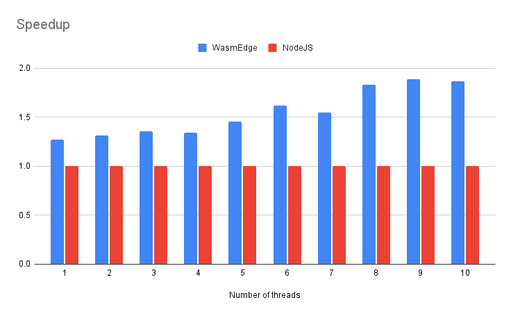

# WasmEdge-Mandelbrot-Example

This example tests the performance of WasmEdge and NodeJS. The C code is original from [ColinEberhardt/wasm-mandelbrot](https://github.com/ColinEberhardt/wasm-mandelbrot/blob/master/wasm/mandelbrot.c), which randers image of Mandelbrot set using wasm. We adopted it into a multi-worker version that parallelly renders the image.

The C code was compiled into wasm with clang toolchain. The wasm file was loaded by different runtimes. The memory is shared between workers to render the image parallelly.  

+ WasmEdge 
    + WasmEdge C-API
    + The wasm file is compiled into shared library using AOT compiler
    + Multi-threaded with `std::threads` 
+ NodeJS 
    + NodeJS WebAssembly (V8)
    + Multi-threaded with JS Worker threads

## Installation && Test

Please follows the [installation step](https://wasmedge.org/book/en/start/install.html) to install WasmEdge.

```
npm install canvas
make
bash test.bash
```

## Results

The results were tested on `Intel(R) Xeon(R) Gold 6226R CPU` and `node v14.18.2`.
This experiment shows:
1. single-threaded WasmEdge Runtime outperforms NodeJS runtime by 1.27x 
2. Multi-threaded WasmEdge has better thread scalability compared with multi-worker NodeJS

**Elapsed Time (ms)**
| Number of threads | WasmEdge |    NodeJS   |
|:-----------------:|:--------:|:-----------:|
|         1         |  539.794 |  685.118577 |
|         2         |  294.11  | 385.7991362 |
|         3         |  236.434 |  320.609827 |
|         4         |  185.155 | 248.6372709 |
|         5         |  161.842 | 235.0162029 |
|         6         |  128.459 | 207.5157967 |
|         7         |  117.988 |  182.824234 |
|         8         |  99.629  | 182.1028929 |
|         9         |  89.2532 | 168.5531969 |
|         10        |  86.9667 | 162.1774654 |





### Images

**output-node.png**


**output-wasmedge.png**


